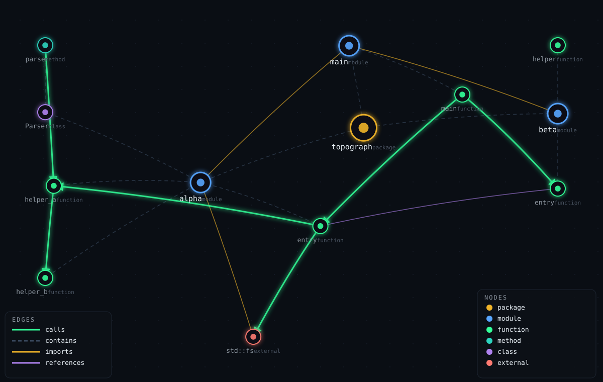

# codetopo

**See your codebase the way an agent sees it.** codetopo turns a source
repository into a queryable code graph — symbols, calls, references, and
structure — with JSON answers an AI coding agent can act on directly.

You are here because an agent just touched your codebase and you want to
answer structural questions fast: *what calls this function? what breaks if
I change this? how are these two modules connected?* codetopo indexes the
tree once and answers those questions as data — counts first, full lists
only when asked — over a CLI, an HTTP API, or the MCP tools your agent
already speaks.

It is deliberately domain-blind: no scoring, no rankings, no opinions about
what the code means. It answers structural questions about source trees, and
only that. Domain meaning belongs to the agents and teams composing on top.



## 60-second quickstart

Requires a stable Rust toolchain (install via [rustup](https://rustup.rs)).

```sh
# Install the four binaries: codetopo (CLI), codetopo-server (HTTP API),
# codetopo-mcp (stdio MCP server), codetopo-acp (stdio ACP agent)
cargo install --git https://github.com/nrupala/codetopo

# Index a repository (Rust and TypeScript/JavaScript are parsed via tree-sitter)
codetopo index ~/my-project --db graph.db

# Ask what calls what
codetopo descendants myproject::net::Client::connect --db graph.db --expand
```

That's the whole loop: **index once, query as data.** Aggregate-first
output — totals before lists — keeps token budgets and pipes sane by
default; `--expand` brings the full list when you want it.

## Example queries

Against the fixture repository used in the project's own end-to-end
verification (`docs/phase-2-verification.md`) — output shown is the real
output of the CLI:

```sh
$ codetopo index crates/codetopo-server/tests/fixture-repo --db graph.db
files indexed: 3
files failed: 0
symbols: 15
nodes: 15
edges: 23
diagnostics: 2

$ codetopo stats --db graph.db
nodes: 15
  package: 1
  module: 3
  file: 3
  function: 6
  external: 2
edges: 23
  calls: 5
  references: 6
  contains: 12

$ codetopo descendants fixture-repo::alpha::entry --db graph.db --expand
descendants of fixture-repo::alpha::entry 2
fixture-repo::alpha::helper_a
fixture-repo::alpha::helper_b
```

A few more things you can ask (same engine, same data):

```sh
codetopo ancestors <node-id> --db graph.db     # what depends on this node
codetopo blast-radius <node-id> --db graph.db  # what a failure here would take with it
codetopo path <from-id> <to-id> --db graph.db  # shortest typed path between two nodes
codetopo verify --db graph.db                  # verify the hash-chained audit log
codetopo snapshot --db graph.db --out g.json   # portable frozen JSON export of the whole graph
```

The `path` answer renders as typed steps, e.g. `a --calls--> x --imports--> b`
(illustrative; exact ids depend on your index).

## Giving it to your agent

### HTTP API (`codetopo-server`)

The same queries over JSON, behind Bearer API-key auth, with per-request
metering — one transport for any client, any language:

```sh
echo "demo-key:change-me" > api_keys && chmod 600 api_keys
codetopo-server   # listens on 127.0.0.1:8080 by default

curl -H "Authorization: Bearer demo-key:change-me" -X POST localhost:8080/v1/index \
  -H 'Content-Type: application/json' -d '{"repo_path": "~/my-project"}'
# {"index_id": "<uuid>", "files_indexed": 3, "files_failed": 0, "nodes": 15, "edges": 23, "diagnostics": 2}

curl -H "Authorization: Bearer demo-key:change-me" \
  "localhost:8080/v1/graphs/<uuid>/descendants?node=<node-id>&expand=true"
```

Eight endpoints under `/v1`, one index operation plus seven read-only
queries: `POST /v1/index`, `GET /v1/graphs/{id}/{descendants, ancestors,
blast-radius, path, stats, verify, snapshot}`. Full contract in
[`schemas/openapi.yaml`](schemas/openapi.yaml) (OpenAPI 3.1.0), env knobs
(`CODETOPO_BIND`, `CODETOPO_DATA_DIR`, `CODETOPO_KEYS_FILE`,
`CODETOPO_METERING_LOG`) documented in [`schemas/README.md`](schemas/README.md).

### MCP (`codetopo-mcp`)

A stdio JSON-RPC server exposing the same handler layer as eight tools —
`codetopo_index`, `codetopo_descendants`, `codetopo_ancestors`,
`codetopo_blast_radius`, `codetopo_path`, `codetopo_stats`,
`codetopo_verify`, `codetopo_snapshot` — so an in-process agent learns one
surface and gets both. MCP answers are identical to the HTTP answers by
construction: both call the same `codetopo-core` queries.

```json
{ "mcpServers": { "codetopo": { "command": "codetopo-mcp" } } }
```

### ACP (`codetopo-acp`)

A stdio agent speaking the Agent Client Protocol — for editors and clients
that converse with agents instead of calling tools. Open a session on a
working directory and ask code-structure questions in plain language:

```
→ {"jsonrpc":"2.0","id":1,"method":"initialize","params":{}}
← {"jsonrpc":"2.0","id":1,"result":{"agent":"codetopo","protocolVersion":"1.0",
    "agentCapabilities":{"read_only":true,"code_structure":true},"agentInfo":{"name":"codetopo"}}}
→ {"jsonrpc":"2.0","id":2,"method":"session/new","params":{"cwd":"/path/to/repo"}}
→ {"jsonrpc":"2.0","id":3,"method":"session/prompt",
    "params":{"sessionId":"<id>","prompt":"blast radius of auth::login"}}
← {"jsonrpc":"2.0","id":3,"result":{"answer":"Blast radius of 'auth::login': 14 nodes — …"}}
```

Deterministic intent routing (descendants / ancestors / blast-radius / path /
stats / snapshot / verify) straight to the same `codetopo-core` queries —
no LLM, no network, no file writes. Edit requests get an honest read-only
refusal. stdout carries only protocol frames; diagnostics go to stderr.

## Architecture

```
        ┌─────────────┐   tree-sitter    ┌──────────────┐
        │ source tree │ ───────────────► │ codetopo-    │   extract symbols,
        └─────────────┘   Rust, TS/JS     │ extract      │   calls, references
                                          └──────┬───────┘
                                                 ▼
                                          ┌──────────────┐
                                          │ codetopo-core│   graph model:
                                          │              │   nodes, edges,
                                          │              │   traversal queries
                                          └──────┬───────┘
                                                 ▼
                                          ┌──────────────┐
                                          │ codetopo-    │   SQLite store +
                                          │ store        │   hash-chained
                                          │              │   audit log
                                          └──────┬───────┘
                                                 │
              ┌──────────────────────────────────┼─────────────────────────────┐
              ▼                                  ▼                             ▼                              ▼
       ┌──────────────┐                  ┌──────────────┐               ┌──────────────┐              ┌──────────────┐
       │ codetopo     │                  │ codetopo-    │ Bearer auth  │ codetopo-    │ stdio        │ codetopo-    │ stdio
       │ (CLI)        │                  │ server       │ JSONL        │ mcp          │ JSON-RPC     │ acp          │ ACP
       └──────────────┘                  └──────────────┘  metering    └──────────────┘              └──────────────┘
```

| Crate | Role |
|---|---|
| `codetopo-core` | Graph model, node/edge kinds, all traversal queries, snapshots |
| `codetopo-extract` | tree-sitter extractors (Rust, TypeScript/JavaScript) |
| `codetopo-store` | SQLite persistence + tamper-evident, hash-chained audit log |
| `codetopo-cli` | `codetopo` headless CLI — the reference query surface |
| `codetopo-server` | `codetopo-server` axum HTTP API (thin adapter over core) |
| `codetopo-mcp` | `codetopo-mcp` stdio MCP server (thin adapter over core) |
| `codetopo-acp` | `codetopo-acp` stdio ACP agent — conversational sessions over the Agent Client Protocol (thin adapter over core) |

The CLI, HTTP, MCP, and ACP surfaces are all thin adapters over the same
handlers — they cannot disagree. `schemas/` keeps the machine-readable
contracts (OpenAPI 3.1, MCP tool catalogue) checked against the running
servers. The store's audit log follows the trust-primitive pattern used
across this product line: a hash-chained, append-only record, verified by
`codetopo verify` / `GET …/verify`.

## Docs

- [`docs/phase-2-design.md`](docs/phase-2-design.md) — API design: endpoints, auth, metering, aggregate-first discipline
- [`docs/phase-2-verification.md`](docs/phase-2-verification.md) — end-to-end verification report (fixture numbers above come from here)
- [`docs/phase-3-acp-design.md`](docs/phase-3-acp-design.md) — ACP agent design: wire protocol, intent routing, read-only guarantee
- [`docs/phase-3-acp-verification.md`](docs/phase-3-acp-verification.md) — ACP verification report
- [`schemas/README.md`](schemas/README.md) — the two agent-facing contracts and where the spec departs from the design doc
- [`CODE_SCHEMA.md`](CODE_SCHEMA.md) — the graph schema (§6 sets the aggregate-first rule)

## License

- Engine (`codetopo-*` crates): **AGPL-3.0-or-later** (see `LICENSES/`)
- Agent-facing contracts (`schemas/`: OpenAPI 3.1 spec, MCP tool catalogue): **Apache-2.0** (see `schemas/LICENSE-APACHE`)

Owned by Nrupal Akolkar · Built with Muse by Meta.
